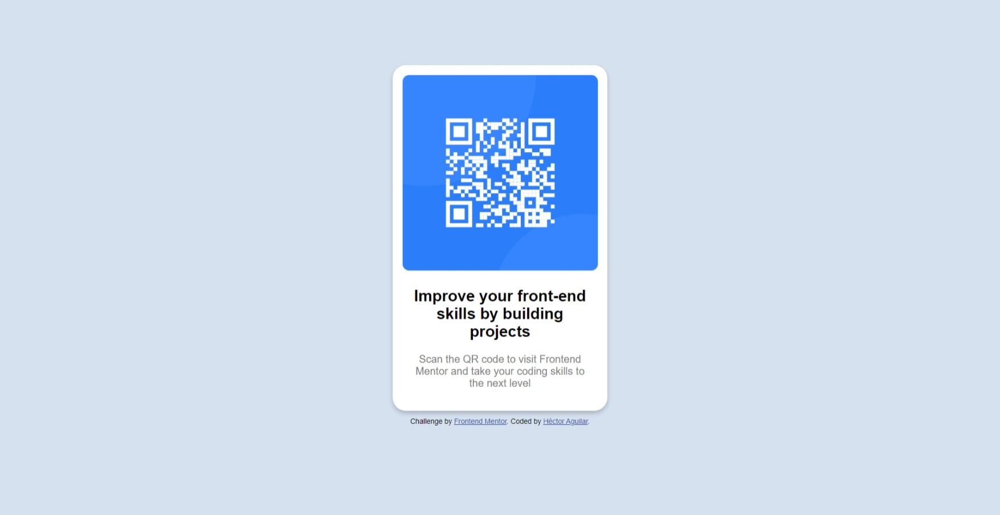

# Frontend Mentor - QR code component solution

This is a solution to the [QR code component challenge on Frontend Mentor](https://www.frontendmentor.io/challenges/qr-code-component-iux_sIO_H). Frontend Mentor challenges help you improve your coding skills by building realistic projects. 

## Table of contents

- [Screenshot](#screenshot)
- [Links](#links)
- [My process](#my-process)
  - [Built with](#built-with)
  - [Continued development](#continued-development)
  - [Useful resources](#useful-resources)
- [Author](#author)

## Screenshot

## Links

- Live Site URL: [Add live site URL here](https://hectoragvalenzuela.github.io/QR-code-component/)

## My process

### Built with

- Semantic HTML5 markup
- CSS custom properties
- Flexbox

### Continued development

I want to continue developing in the area of responsiveness, I feel that I still lack skills to develop.

### Useful resources

- [Temaplate from W3School](https://www.w3schools.com/howto/tryit.asp?filename=tryhow_css_profile_card) - This helped me for start the project. I base my patterns in this code!

## Author

- Frontend Mentor - [@HectorAgValenzuela](https://www.frontendmentor.io/profile/HectorAgValenzuela)
- Twitter - [@DINO_3_14](https://twitter.com/DINO_3_14)

